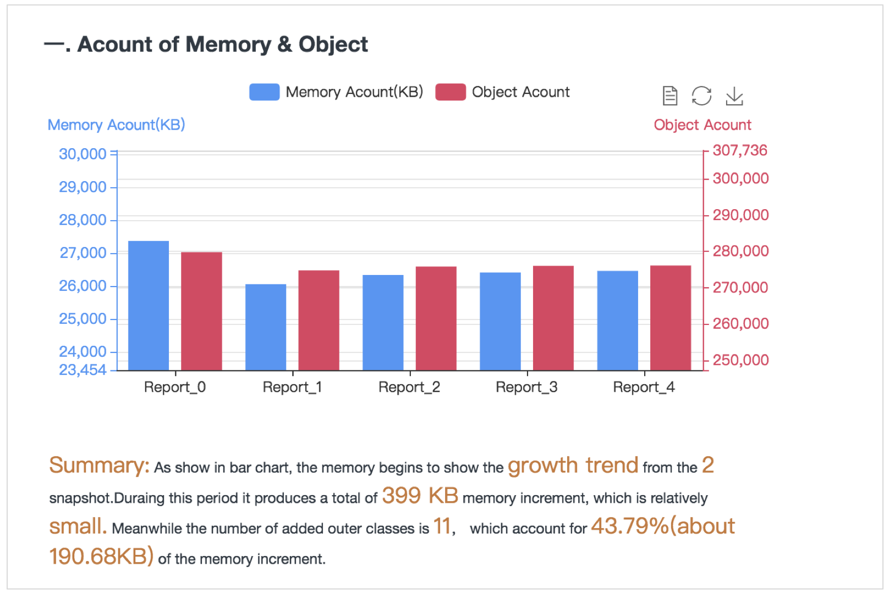
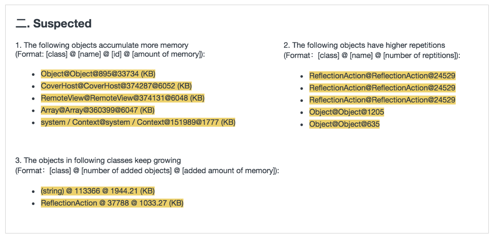
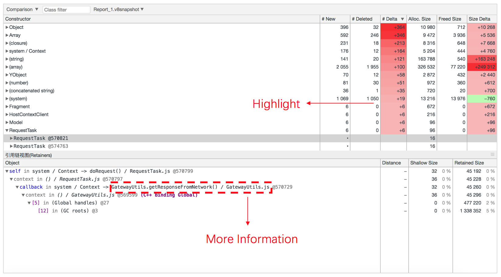
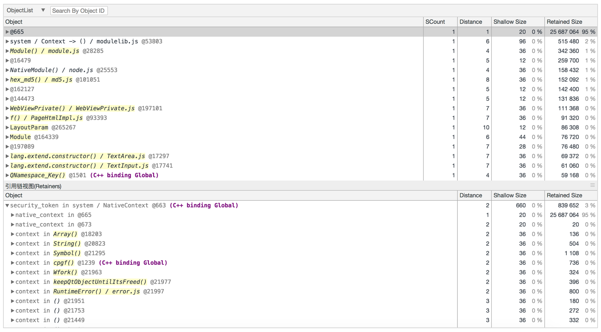

# JS Memory Analysor

## Overview
Memory leak is an important problem in JavaScript/NodeJS, though they have Garbage collection mechanism. Now there are some tools are provided to detect memory leak for JavaScript/NodeJS, such as Chrome Devtools, Webstorm and so on. These tools solve our problems in some extent. However, there are also some problems left, such as not smart enough to recommend suspected objects.
 
 
Compared to above, JS Memory Analysor provides more convenient functionality to help us find memory leak objects more quickly. To retained the habits of JS developers and reduce the learning cost, JS Memory Analysor is developed base on Chrome Devtools.

## Table of Contents

- [Quick start](#quick-start)
- [Features](#features)
- [Todo list](#todo-list)
- [License](#license)

## Quick Start

It is easy to use JS Memory Analysor. Just with the steps as follows:

* `git clone [current repo] [project path]`
* `cd [project path]`
* `npm install && npm run start`
* `open the Chrome with http://localhost:9999`

After open the browser, you should load multiple local files(.heapsnapshot) <b>simultaneously</b>. These heap snapshots are dumped duration the operation of the application.

<b>( PS: Please use chrome to open above link. )</b>

## Features
Compared to native Chrome Devtools，there are several advantages as follows: 

1) Intelligent summary. It will generate summary according to multi-snapshots' memory trends and changes of objects just as shown in the following picture.

2) Recommend suspected memory leaks. JS Memory Analysor provides the objects that are more likely to exist memory leaks in different scenes in order to help users to locate problems more quickly. As shown in the picture, there are three kinds of recommendations are displayed. 

3) Highlight and show more complete information. Highlight can help users focus on important objects more quickly and the later help trace problem more conveniently.

4) Add a view to display object list. It is useful for us to search a object or do some operations such as sorting to find objects that we are intersted in. The added attribute of SOCount(Similar Object Count) help us find objects that are similary which base on multi-attributes, such as Distance, Class, Shallow Size, Retained Size and so on. 

Related terms of memory leaks can refer to  [https://developers.google.com/web/tools/chrome-devtools](https://developers.google.com/web/tools/chrome-devtools/)

## Todo List
* Collect js memory leak cases
* Provide more flexible interactions
* Optimize recommendation algorithm

## License

[BSD-3-Clause](https://opensource.org/licenses/BSD-3-Clause)

